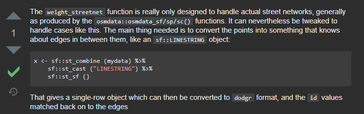

```{r setup, include = F}
# This is the recommended set up for flipbooks
# you might think about setting cache to TRUE as you gain practice --- building flipbooks from scratch can be time consuming
knitr::opts_chunk$set(
  fig.width = 6, message = FALSE, warning = FALSE, comment = "", cache = FALSE, fig.retina = 3
)
knitr::opts_knit$set(global.par = TRUE)
#remotes::install_github(EvaMaeRey/flipbookr)
library(flipbookr)
#install('xaringanthemer')
library(xaringanthemer)
library(sfnetworks)
```

```{r xaringan-themer, include = F}
style_mono_accent(
  base_color = 'orange',
  title_slide_background_image = "figs/milano.png",
  background_image = "figs/milano_bg.png",
  code_font_size = '14px',
  text_slide_number_color = 'grey70',
  link_color = 'orangered',
  extra_css = list(
    ".pull-left-70" = list("float" = "left", "width" = "65.8%"),
    ".pull-right-30" = list("float" = "right", "width" = "28.2%")
  )
)
```

```{r color, echo = FALSE, results='asis'}
# crayon needs to be explicitly activated in Rmd
options(crayon.enabled = TRUE)
# Hooks needs to be set to deal with outputs
# thanks to fansi logic
old_hooks <- fansi::set_knit_hooks(knitr::knit_hooks,
                                   which = c("output", "message", "error"))
```

```{r, include = F, eval = F}
# Code to create scrolling bar / not working good with flipbookr
# ```{css, echo=FALSE}
# pre {
#   max-height: 90%;
#   overflow-y: auto;
#   background-color: inherit;
# }
# 
# pre[class] {
#   max-height: 50%;
# }
# ```
```

---
## Geospatial Networks


---
## Geospatial in R


---
## Networks in R

.pull-left[
- igraph
- tidygraph
- ...
]
.pull-right[


.footnote[
Plot by [Shirin Glander](https://datascienceplus.com/network-analysis-of-game-of-thrones/)
]
]
---
class: center, middle

# then...

## why a new package?

---

## Why a new package?

.pull-left[

]
--
.pull-right[

]

---

## Why a new package?

.center[

]

---

## Why a new package?

.center[

]

---
## Why a new package?

<center><blockquote class="twitter-tweet"><p lang="en" dir="ltr">One of the biggest reasons we still have ArcGIS licenses is for Network Analysis (drive times, service areas etc). Does anyone have <a href="https://twitter.com/hashtag/foss4g?src=hash&amp;ref_src=twsrc%5Etfw">#foss4g</a> tools for this they like? Last time we tried pgRouting (yrs ago) it didn&#39;t feel fully formed yet, <a href="https://twitter.com/hashtag/gischat?src=hash&amp;ref_src=twsrc%5Etfw">#gischat</a></p>&mdash; Zev Ross (@zevross) <a href="https://twitter.com/zevross/status/1089908839816794118?ref_src=twsrc%5Etfw">January 28, 2019</a></blockquote></center> <script async src="https://platform.twitter.com/widgets.js" charset="utf-8"></script>

---
class: center, middle

.pull-left[

]

--

.pull-right[

]
--

## `sfnetworks`

The best of both worlds!
---
class: middle

.pull-left-70[


.footnote[
Artwork by [@allison_horst](https://twitter.com/allison_horst)
]
]

.pull-right-30[
- Simple features for R
- Spatial vector data (points, lines and polygons)
- Compatible with *tidy* workflows
- S3 classes
]
---

 igraph


---
### Installation

```{r, eval = F}
remotes::install_github("luukvdmeer/sfnetworks")
library(sfnetworks)
```

---

### `sfnetwork` class and methods

---

`r chunk_reveal(chunk_name = "object", break_type = "user", display_type = "both")`

```{r object, include = F}
# `sfnetworks` pre-loaded LINESTRING  
# `sf` object for Roxel, NRW, Germany
roxel %>% #BREAK
  # convert to an `sfnetwork` object
  as_sfnetwork() %>% #BREAK
  class() #BREAK
```

---

`r chunk_reveal(chunk_name = "sfnetworks_options", break_type = "non_seq", display_type = "both")`

```{r sfnetworks_options, include = F}
roxel %>% 
  as_sfnetwork(
    directed = F, #BREAK2
    edges_as_lines = F #BREAK3
  ) #BREAK
```

The construction function has two main options...
---

`r chunk_reveal(chunk_name = "plot", break_type = "non_seq", display_type = "both")`

```{r plot, include = F}
par(mar = c(1, 1, 1, 1))
roxel %>% 
  as_sfnetwork(
    directed = F,
    edges_as_lines = F #BREAK2
  ) %>% #BREAK
  plot() #BREAK
```

which are better observed when plotted!

---

## What is out there already?

--

- [dodgr](https://atfutures.github.io/dodgr/)

--

- [cppRouting](https://github.com/vlarmet/cppRouting)

--

- [shp2graph](https://r-forge.r-project.org/projects/shp2graph)

--

- [spnetwork](https://github.com/edzer/spnetwork)

--

- [stplanr](https://docs.ropensci.org/stplanr/)

--

- ...
