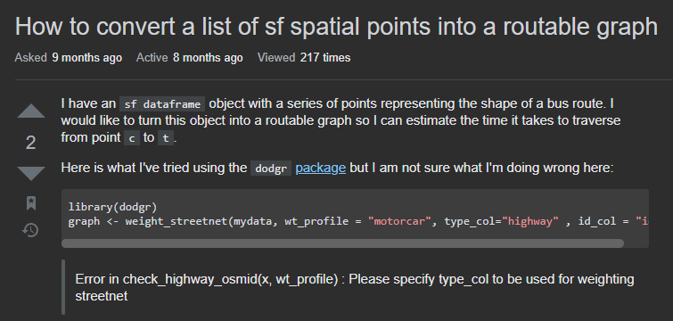
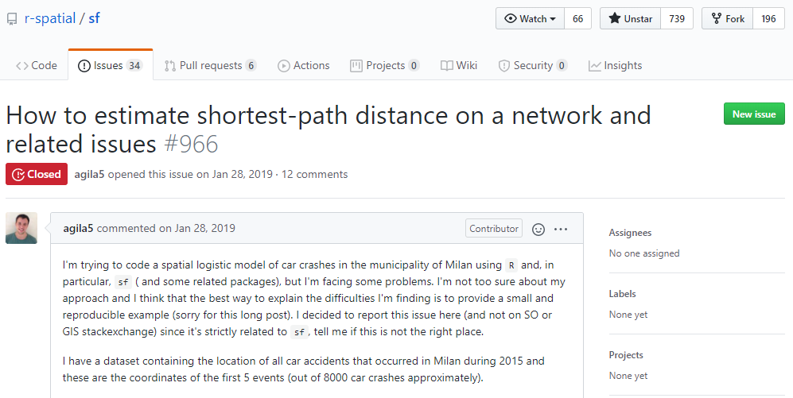
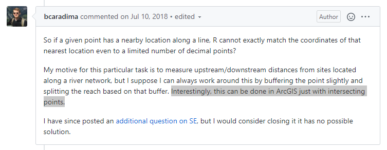
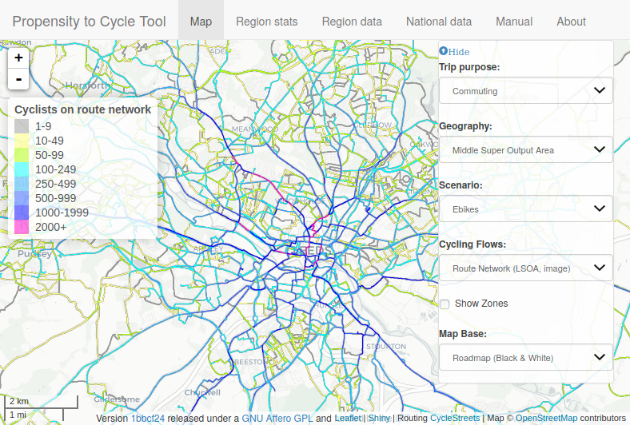

class: center, middle

```{r setup, include = F}
# This is the recommended set up for flipbooks
# you might think about setting cache to TRUE as you gain practice --- building flipbooks from scratch can be time consuming
options(width = 70)
knitr::opts_chunk$set(
  fig.width = 6, message = FALSE, 
  warning = FALSE, comment = "", cache = TRUE, fig.retina = 3
)
knitr::opts_knit$set(global.par = TRUE)
# remotes::install_github("luukvdmeer/sfnetworks")
# remotes::install_github("EvaMaeRey/flipbookr")
library(flipbookr)
# install('xaringanthemer')
library(xaringanthemer)
library(sfnetworks)
library(dplyr)
library(sf)
library(tidygraph)
```


```{r xaringan-themer, include = F}
style_mono_accent(
  # hex color should be provided, or theme_xaringan doesn't work
  base_color = '#ffa500', #orange
  title_slide_background_image = "figs/milano.png",
  background_image = "figs/milano_bg.png",
  code_font_size = '14px',
  text_slide_number_color = '#b3b3b3', #grey70
  link_color = '#ff4500', #orangered  
  footnote_font_size = '0.5em',
  footnote_position_bottom = "30px",
  code_highlight_color = "#ffedcc", #faded-orange
  extra_css = list(
    ".pull-left-70" = list("float" = "left", "width" = "65.8%"),
    ".pull-right-30" = list("float" = "right", "width" = "28.2%"),
    ".pull-left-30" = list("float" = "left", "width" = "28.2%"),
    ".pull-right-70" = list("float" = "right", "width" = "65.8%"),
    ".orange" = list("color" = "#ffa500")
  )
)
```

```{r color, echo = FALSE, results='asis'}
# crayon needs to be explicitly activated in Rmd
options(crayon.enabled = TRUE)
# Hooks needs to be set to deal with outputs
# thanks to fansi logic
old_hooks <- fansi::set_knit_hooks(knitr::knit_hooks,
                                   which = c("output", "message", "error"))
```

```{r, include = F, eval = F}
# Code to create scrolling bar / not working good with flipbookr
# ```{css, echo=FALSE}
# pre {
#   max-height: 90%;
#   overflow-y: auto;
#   background-color: inherit;
# }
# 
# pre[class] {
#   max-height: 50%;
# }
# ```
```

## Hello from the team!
.center[


]
--
.center[
what brought us together?
]
---
class: center, middle

## Geospatial Networks

--
.pull-left[
Road networks

]

--
.pull-right[
River networks

]

--

[**spnethack**](https://github.com/sfnetworks/spnethack) organised in Munster, 2019

Building on Luuk's MSc project while Robin was visiting [ifgi](https://www.uni-muenster.de/Geoinformatics/en/) 

Result: [Spatial networks in R with sf and tidygraph](https://www.r-spatial.org/r/2019/09/26/spatial-networks.html) blog post

---

.pull-left-30[
## Geospatial in R

- [\#rspatial](https://twitter.com/search?q=%23rspatial)
- `sf`
- `stars`
- `rgeos`
- `rgdal`
- `tmap`
- `ggmap`
- `mapview`
- ...

]


.pull-right-70[
```{r geospatial_r, dpi = 350, echo = F, strip.white = T, fig.dim = c(6,5), dev.args = list(bg = 'transparent'), out.width = '100%'}
library(ggplot2)
ggplot() +
  geom_sf(data = roxel) + 
  coord_sf(label_graticule = "NE") +
  theme(
    axis.ticks = element_line(color = 'grey70'),
    panel.grid = element_line(color = 'grey70', linetype = 'dotted', size = 0.5),
    panel.background = element_rect(fill = "transparent"),
    plot.background = element_rect(fill = "transparent", color = NA)
  )
```

]
---

.pull-left-30[
## Networks in R

- [statnet](http://statnet.org/)
- `igraph`
- `tidygraph`
- `qgraph`
- `ggraph`
- `visNetwork`
- `networkD3`
- ...
]

.pull-right-70[
```{r network_ex, dpi = 350, echo = F, strip.white = T, fig.dim = c(5,5), dev.args = list(bg = 'transparent'), out.width = '90%'}
library(ggraph)
graph = roxel %>% as_sfnetwork(directed = F) %>% convert(to_components)
ggraph(graph, 'focus', focus = node_is_center()) +
  ggforce::geom_circle(
    aes(x0 = 0, y0 = 0, r = r), 
    data.frame(r = 1:20), colour = 'grey'
  ) +
  geom_edge_link() +
  geom_node_point(color = 'orangered') +
  coord_fixed() +
  theme(
    panel.background = element_rect(fill = "transparent"),
    plot.background = element_rect(fill = "transparent", color = NA)
  )
```
]

---
class: center, middle

# then...

## why a new package?

---

.center[
## why a new package?


]

---

.center[
## why a new package?


]

---

.center[
## why a new package?


]

---
class: center
## why a new package?

<center><blockquote class="twitter-tweet"><p lang="en" dir="ltr">One of the biggest reasons we still have ArcGIS licenses is for Network Analysis (drive times, service areas etc). Does anyone have <a href="https://twitter.com/hashtag/foss4g?src=hash&amp;ref_src=twsrc%5Etfw">#foss4g</a> tools for this they like? Last time we tried pgRouting (yrs ago) it didn&#39;t feel fully formed yet, <a href="https://twitter.com/hashtag/gischat?src=hash&amp;ref_src=twsrc%5Etfw">#gischat</a></p>&mdash; Zev Ross (@zevross) <a href="https://twitter.com/zevross/status/1089908839816794118?ref_src=twsrc%5Etfw">January 28, 2019</a></blockquote></center> <script async src="https://platform.twitter.com/widgets.js" charset="utf-8"></script>

--

...

because open source can always get better!

---
class: center, middle

## What do we propose?

--
.pull-left[

]

--

.pull-right[

]
--

## `sfnetworks`

The best of both worlds!
---
class: middle

.pull-left-70[
.center[

]
.footnote[
Artwork by [@allison_horst](https://twitter.com/allison_horst)
]
]

.pull-right-30[
### *tidy* workflows
> In tidy data:
1. Each variable forms a column.
2. Each observation forms a row.
3. Each type of observational unit forms a table.

.footnote[
Wickham, H. (2014). Tidy Data. Journal of Statistical Software, 59(10), 1 - 23. doi:http://dx.doi.org/10.18637/jss.v059.i10
]

- Supported by the *tidyverse*

- Allows piping `%>%` structures 

]

---
class: center, middle

.pull-left-70[

.footnote[
Artwork by [@allison_horst](https://twitter.com/allison_horst)
]
]

.pull-right-30[

### **`sf` package**

Simple features for R

Spatial vector data (points, lines and polygons)

Compatible with *tidy* workflows

S3 classes
]
---
class: center, middle

.pull-left-70[

.footnote[
Plot from [R GRaph Gallery](https://www.r-graph-gallery.com/339-circular-dendrogram-with-ggraph.html)
]
]

.pull-right-30[

### **`tidygraph` package**

 Interfaces with [`igraph`](https://igraph.org/r/)  
 

 Supports [`dplyr`](https://dplyr.tidyverse.org/) *verbs* 


 Introduces new *verbs* specific to network data (e.g. `morph`, `bind_graphs`, `graph_join`)


 Allows network visualization via [`ggraph`](https://ggraph.data-imaginist.com/)
]

---
class: center, middle

## So, let's dive in...

---
### Installation 

Install the more stable master branch with:

```{r, eval = F}
remotes::install_github("luukvdmeer/sfnetworks")
```

Install the develop branch, where most of the development takes place and where PRs should be directed:

```{r, eval = F}
remotes::install_github("luukvdmeer/sfnetworks", ref = "develop")
```

---
## `sfnetwork` data structure

### Philosophy

--

> "... a close approximation of tidyness for relational data is two tidy data frames, one describing the node data and one describing the edge data."

`tidygraph` introduction.

--

<br>
<br>

> “A close approximation of tidyness for relational .orange[*geospatial data*] is two .orange[*sf objects*], one describing the node data and one describing the edge data.”

`sfnetworks` adaption.

---
## `sfnetwork` data structure

### Construction

- Nodes: `sf` object with `POINT` geometries

- Edges: *to* and *from* column with end-points

   + spatially explicit: `sf` object with `LINESTRING` geometries

   + spatially implicit: `data.frame` or `tibble` object

- Same CRS!

---
`r chunk_reveal(chunk_name = "toyexample", break_type = "user", display_type = "both")`

```{r toyexample, include = F}
p1 = st_point(c(7, 51))
p2 = st_point(c(7, 52))
p3 = st_point(c(8, 52))

st_sfc(
    p1, p2, p3,
    crs = 4326
  ) %>% st_sf() -> #BREAK
  nodes #BREAK

st_sfc(
  st_cast(st_union(p1,p2), "LINESTRING"),
  st_cast(st_union(p1,p3), "LINESTRING"),
  st_cast(st_union(p2,p3), "LINESTRING"),
  crs = 4326
) %>% st_sf() -> #BREAK
  edges #BREAK

edges$from = c(1, 1, 2)
edges$to = c(2, 3, 3) #BREAK

sfnetwork(nodes, edges, directed = FALSE) #BREAK
```

---
## `sfnetwork` data structure

### Foreign objects

To convert foreign objects into an `sfnetwork` with `as_sfnetwork`, there are two conditions:

- Object is or can be converted to a `tbl_graph`.

- At least the nodes can be converted to an `sf` object.

--

Or just an `sf` object with `POINT` or `LINESTRING` geometry... but some assumptions are made! 

--

More methods were recently added for `sfNetwork`, `linnet` and `psp` objects!

---

`r chunk_reveal(chunk_name = "object", break_type = "user", display_type = "both")`

```{r object, include = F}
# `sfnetworks` pre-loaded LINESTRING  
# `sf` object for Roxel, NRW, Germany
roxel %>% #BREAK
  # convert to an `sfnetwork` object
  as_sfnetwork() %>% #BREAK
  class() #BREAK
```

---
## `sfnetwork` data structure

### Arguments for construction

- directed graph?

- spatially explicit edges?
---

`r chunk_reveal(chunk_name = "sfnetworks_options", break_type = "non_seq", display_type = "both")`

```{r sfnetworks_options, include = F}
roxel %>% 
  as_sfnetwork(
    directed = F, #BREAK2
    edges_as_lines = F #BREAK3
  ) #BREAK
```

---
## `sfnetwork` data structure

### Arguments for construction

better observed when plotted...

---

`r chunk_reveal(chunk_name = "plot", break_type = "non_seq", display_type = "both")`

```{r plot, include = F, dev.args = list(bg = 'transparent')}
par(mar = c(1, 1, 1, 1), bg = NA)
roxel %>% 
  as_sfnetwork(
    directed = F,
    edges_as_lines = F #BREAK2
  ) %>% #BREAK
  plot() #BREAK
```

---
## `sfnetwork` data structure

### Activation and extraction

Same principle as `tidygraph` with the `activate` verb

---
`r chunk_reveal(chunk_name = "activate", break_type = "user", display_type = "both")`

```{r activate, include = F}
roxel %>% 
  as_sfnetwork() %>% #BREAK
  activate('edges')  %>% #BREAK
  st_as_sf() #BREAK

roxel %>% 
  as_sfnetwork(
    edges_as_lines = F 
  ) %>% 
  activate('edges')  %>% 
  as_tibble() #BREAK  
```
---

## What is out there already?

--

- [dodgr](https://atfutures.github.io/dodgr/)

--

- [cppRouting](https://github.com/vlarmet/cppRouting)

--

- [shp2graph](https://r-forge.r-project.org/projects/shp2graph)

--

- [spnetwork](https://github.com/edzer/spnetwork)

--

- [stplanr](https://docs.ropensci.org/stplanr/)

--

- ...

---

background-image: url(https://pbs.twimg.com/media/EZvQNJlWoAE4D_c?format=jpg&name=4096x4096)

# Applications 

--

<br>
<br>
<br>
<br>
<br>
<br>
<br>
<br>
<br>
<br>
<br>
<br>
<br>
<br>
<br>


Many potential applications including:

Transport planning/modelling (Robin), Road safety (Andrea), River network analysis (e.g. Water quality research, Flooding research, Aquatic ecology) Electricity network analysis, Social network analysis, Many More!

---

### How to cope with reduced public transport capacity post COVID-19?

Plans from Leeds City Council responding to national [guidance](https://www.gov.uk/government/publications/reallocating-road-space-in-response-to-covid-19-statutory-guidance-for-local-authorities) and [funding](https://www.gov.uk/government/news/2-billion-package-to-create-new-era-for-cycling-and-walking) for 'pop-up' cycleways:


---

## Spatial networks can support planning

### Transport networks are spatial networks

Spatial network representation in R:


---

background-image: url("https://raw.githubusercontent.com/cyipt/popupCycleways/master/figures/facet-output.png")
background-position: right
background-size: contain

--

### sf + igraph used in project to support investment in 'pop-ups' nationwide

Every city in England

--

Results in Leeds:

```{r, echo=FALSE, results='markup'}
res_leeds = sf::read_sf("https://www.cyipt.bike/rapid/west-yorkshire/top_routes.geojson")
res_leeds %>% 
  arrange(desc(mean_cycling_potential)) %>% 
  slice(1:5) %>%
  sf::st_drop_geometry() %>% 
  dplyr::select(name) %>% 
  as.data.frame()
```

Cycleway planned for

Kirkstall Road (source: [BBC](https://www.bbc.co.uk/news/uk-england-leeds-52577554))

Free and open results:

[www.cyipt.bike/rapid](https://www.cyipt.bike/rapid)

Source code: [github.com/cyipt/popupCycleways](https://github.com/cyipt/popupCycleways)

<!--  -->

```{r, out.width="70%", echo=FALSE}
# knitr::include_graphics("https://raw.githubusercontent.com/cyipt/popupCycleways/master/figures/facet-output.png")
```


---

## Ingredients to prioritise transport infrastructure

.left-column[

- Current travel patterns
- Road attribute data 
- Potential usage levels
- Impact on overall network

**Spatial networks can help, especially with the last two**

Source: https://www.pct.bike/


]

.right-column[




]

---

## Why not use `stplanr::SpatialLinesNetwork`?

.pull-left[


- You can:

```{r}
r_stplanr = stplanr::SpatialLinesNetwork(roxel)
```

```{r}
l = stplanr::route_local(r_stplanr, c(7.53, 51.95), c(7.54, 51.95))
plot(r_stplanr@sl$geometry)
plot(l$geometry, col = "red", lwd = 5, add = TRUE)
```
]

.pull-right[

Issues with stplanr implementation:

- `igraph` and `sf` parts are separate
- Hard to access the nodes
- Subsetting requires rebuilding the graph

```{r}
class(r_stplanr)
slotNames(r_stplanr) # s4 class system
```

]

---

## Statistical analysis of street networks for road safety

Andrea's part

---
